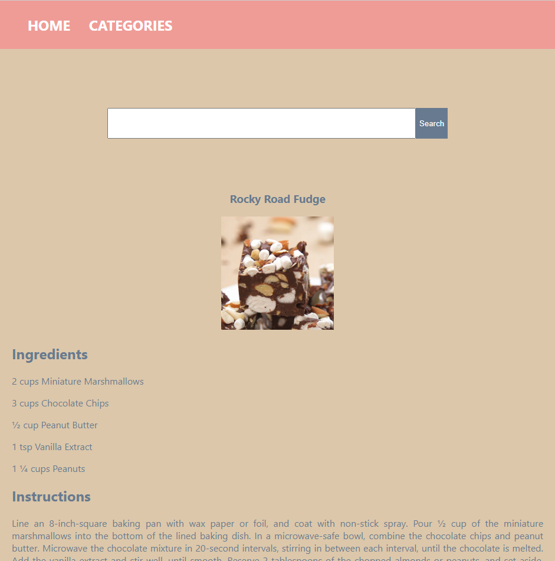

# A simple recipe app

I developed this app using React and [TheMealDb's](https://www.themealdb.com) api. With this app you can search for a recipe by name or category. 

## Getting Started

[Click Here](https://recipe-app-cp5o.onrender.com/) to run the app.\
To search by name, eneter a name in the text field on the homepage. \
To search by category, click on the category link and select a category

## Acknowledgement

This app was developed as a project ay PerScholas, and I would like to acknowledge my instructors, Tishana, Kasper and Dylan for their guidance all through the project.

## Future Works

This app can be improved upon by adding pagination to the category page and search result. A shopping list functionality would be a great improvement.

## Reference and tools
[Why you need an API Layer and how to build it in React] (https://semaphoreci.com/blog/api-layer-react) - Wrote my axiosConfig file by following the step by step guide on this page.\
Deployed with [Render] (https://www.render.com)\
API - [TheMealDb](https://www.themealdb.com)

